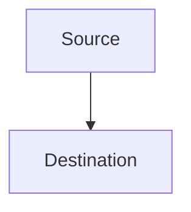
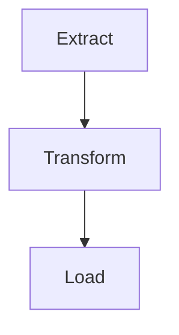
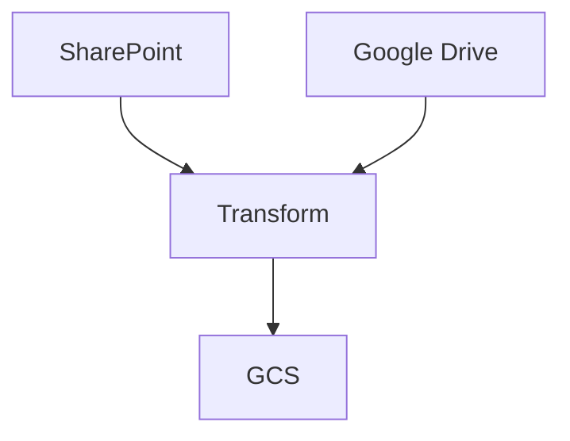

# What's Airflow?

Apache Airflow is Workflow Orchestration, It allows you to program, schedule, and monitor workflows

## What's a Workflow Orchestration?

Workflow Orchestration is the process of triggering and monitoring the status of tasks; nothing more, nothing less.

## Data Pipelines

Process of moving data from one place to another, it can be transforming data, loading data, etc.

Example 1: 

Example 2: ETL

Example 3: ETL with multiple sources

