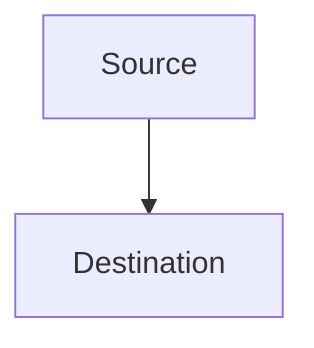
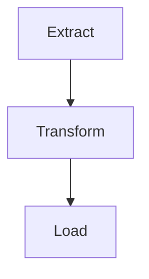
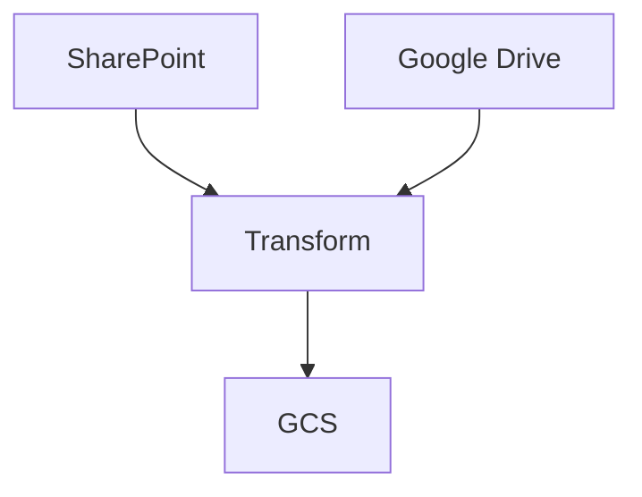

# What's Airflow?

Apache Airflow is Workflow Orchestration, It allows you to program, schedule, and monitor workflows

## What's a Workflow Orchestration?

Workflow Orchestration is the process of triggering and monitoring the status of tasks; nothing more, nothing less.

## Data Pipelines

Process of moving data from one place to another, it can be transforming data, loading data, etc.

Example 1: 



Example 2: ETL



Example 3: ETL with multiple sources



## What's Airflow? (Again)

Airflow is Workflow Orchestration, specifically designed tp batch-oriented workflows.

## Workflow as Code

Allow you to define your workflows as code, which makes it easy to version control, test, and deploy.

```python
from datetime import datetime

from airflow import DAG
from airflow.decorators import task
from airflow.operators.bash import BashOperator

# A DAG represents a workflow, a collection of tasks
with DAG(dag_id="demo", start_date=datetime(2022, 1, 1), schedule="0 0 * * *") as dag:
    # Tasks are represented as operators
    hello = BashOperator(task_id="hello", bash_command="echo hello")

    @task()
    def airflow():
        print("airflow")

    # Set dependencies between tasks
    hello >> airflow()
```

```sh {"id":"01HYB5ZQS6SQNMCNKTK017AMYQ"}

```
