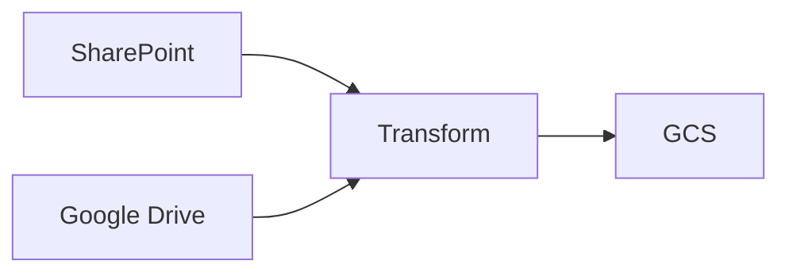

# What's Airflow?

Apache Airflow is Workflow Orchestration, It allows you to program, schedule, and monitor workflows

## What's a Workflow Orchestration?

Workflow Orchestration is the process of triggering and monitoring the status of tasks; nothing more, nothing less.

## Data Pipelines

Process of moving data from one place to another, it can be transforming data, loading data, etc.

Example 1: Source -> Destination


Example 2: ETL


Example 3: ETL with multiple sources



## What's Airflow? (Again)

Airflow is Workflow Orchestration, specifically designed tp batch-oriented workflows.

## Workflow as Code

Allow you to define your workflows as code, which makes it easy to version control, test, and deploy.

```python {"id":"01HYB7G78163BYDKA2K9JA8PCQ"}
from datetime import datetime

from airflow import DAG
from airflow.decorators import task
from airflow.operators.bash import BashOperator

# A DAG represents a workflow, a collection of tasks
with DAG(dag_id="demo", start_date=datetime(2022, 1, 1), schedule="0 0 * * *") as dag:
    # Tasks are represented as operators
    hello = BashOperator(task_id="hello", bash_command="echo hello")

    @task()
    def airflow():
        print("airflow")

    # Set dependencies between tasks
    hello >> airflow()
```

## When to use Airflow?
1. Ability to implement pipelines using Python code
2. Airflow community has already developed a rich collection of extensions that allow Airflow to integrate with many different types of databases, cloud services, and so on
3. Rich scheduling semantics allow you to run your pipelines at specific times, regular intervals, or in response to events
4. Backfilling capabilities allow you to run historical jobs
5. Web interface provides an easy way to monitor result of your pipelines

## When not to use Airflow?
1. Airflow is not designed for real-time processing, it is batch-oriented
2. Highly dynamic pipelines, which added/removed tasks between every pipelines run
3. Little or no Python experience
