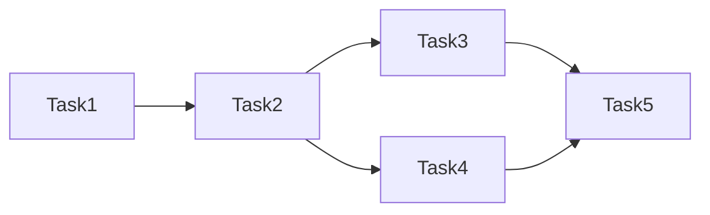
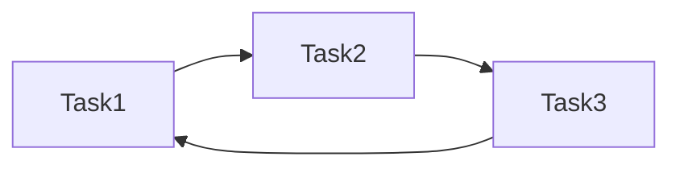

# Overview of Airflow

## Airflow Components

- **Web Server**: The Web Server is the UI for Airflow. provides a UI to manage DAGs and the Airflow environment.
- **Scheduler**: The Scheduler is the core of Airflow. It triggers tasks and manages their dependencies. The Scheduler chooses how to prioritize the running and execution of tasks within the system.
- **Executor**: The Executor is the mechanism by which `task instances` get run. The concept of an executor is a pluggable component of Airflow. Airflow comes with many executors out of the box and you can also provide your own.
- **Metadata Database**: The Metadata Database is the persistent store for metadata related to the state of workflows and tasks in Airflow. The database, often referred to as the metadata database, also stores credentials, connections, history, and configuration.
- __DAGs (Directed Acyclic Graphs)__: A DAG is a collection of all the tasks you want to run, organized in a way that reflects their relationships and dependencies. A DAG’s definition is written in Python files that are placed in Airflow’s DAG_FOLDER.

## Directed Acyclic Graphs (DAGs) ✅



## Not DAGs ❌



## Mai Mee DAGs


## Airflow UI

Start Docker

```bash {"id":"01HYCYGNJXQ8W2M2T46X4MNRMF"}
# Start the Airflow
dokcker compose up -d
```

# Access the Airflow UI

```yaml {"id":"01HYCYGNJXQ8W2M2T46XVT6CM4"}
http://localhost:8080
username: airflow
password: airflow
```

- Overview of DAGs on the Airflow UI
- Pause/Unpause DAGs
- Trigger a DAG
- View the Graph View of a DAG
- Recent Tasks
- Workflow/DAGs Status
- Calendar View
- Logging

## Airflow Concepts

- **Task**: A task is a parameterized instance of an Operator. It describes a single task in a workflow.
- **Operator**: An Operator is a class that acts as a template for carrying out some work. Most Operators require a DAG object in their constructor. The DAG defines the task and the dependencies between tasks.

[Back to Root](../../README.md)
[Go to Next](../chapter-03/README.md)