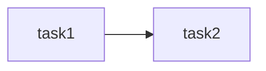
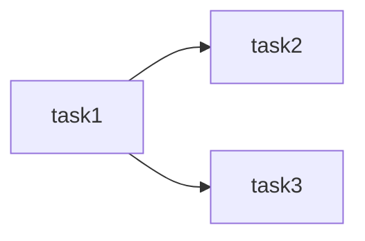
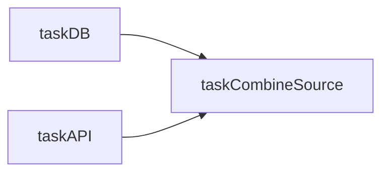

# Dependencies between Tasks

## 1. Basic Dependencies

In Airflow, you can define dependencies between tasks using the `>>` operator.

In the following example, we have two tasks, `task1` and `task2`. We want `task2` to run after `task1` has completed (success). To do this, we use the `>>` operator to define the dependency between the two tasks.



Create a new DAG file `basic_dependencies.py`:

```python
from airflow import DAG
from airflow.operators.python_operator import PythonOperator
from datetime import datetime


with DAG(
        dag_id='basic_dependencies',
        start_date=datetime(2024, 5, 10),
        schedule_interval="@daily",
        catchup=False
    ) as dag:

    def _task1():
        print('Hello, Task 1')

    def _task2():
        print('Hello, Task 2')

    task1 = PythonOperator(
        task_id='task1',
        python_callable=_task1
    )

    task2 = PythonOperator(
        task_id='task2',
        python_callable=_task2
    )

    task1 >> task2
```

## 2. Fan-out and Fan-in

In Airflow, you can define multiple dependencies between tasks. This is known as **fan-out** and **fan-in**.

In the following example, we have three tasks, `task1`, `task2`, and `task3`. We want `task2` and `task3` to run after `task1` has completed (successful). To do this, we use the `>>` operator to define the dependencies between the tasks.

### Fan-out



Create a new DAG file `fanout_dependencies.py`:

```python
from airflow import DAG
from airflow.operators.python_operator import PythonOperator
from datetime import datetime

with DAG(
        dag_id='fan_out',
        start_date=datetime(2024, 5, 10),
        schedule_interval="@daily",
        catchup=False
    ) as dag:

    def _task1():
        print('Hello, Task 1')

    def _task2():
        print('Hello, Task 2')

    def _task3():
        print('Hello, Task 3')

    task1 = PythonOperator(
        task_id='task1',
        python_callable=_task1
    )

    task2 = PythonOperator(
        task_id='task2',
        python_callable=_task2
    )

    task3 = PythonOperator(
        task_id='task3',
        python_callable=_task3
    )

    task1 >> [task2, task3]
```

### Fan-in



Create a new DAG file `fanin_dependencies.py`:

```python
from airflow import DAG
from airflow.operators.python_operator import PythonOperator
from datetime import datetime

with DAG(
    dag_id='fan_in',
    start_date=datetime(2024, 5, 10),
    schedule_interval="@daily",
    catchup=False
) as dag:

    def _taskDB():
        print('Hello, DB')

    def _taskAPI():
        print('Hello, API')

    def _taskCombine():
        print('Hello, Combined Source')

    taskDB = PythonOperator(
        task_id='task1',
        python_callable=_taskDB
    )

    taskAPI = PythonOperator(
        task_id='task2',
        python_callable=_taskAPI
    )
    taskCombineSource = PythonOperator(
        task_id='task3',
        python_callable=_taskCombine
    )
    [taskDB, taskAPI] >> taskCombineSource
```

## 3. Trigger Rules

In Airflow, you can define trigger rules to control when a task is triggered. The default trigger rule is `all_success`, which means that the task is triggered when all upstream tasks have completed successfully.

Here are some of the trigger rules [available in Airflow](https://airflow.apache.org/docs/apache-airflow/1.10.9/concepts.html#trigger-rules):

- `all_success`: (default) all parents have succeeded
- `all_failed`: all parents are in a failed or upstream_failed state
- `all_done`: all parents are done with their execution
- `one_failed`: fires as soon as at least one parent has failed, it does not wait for all parents to be done
- `one_success`: fires as soon as at least one parent succeeds, it does not wait for all parents to be done
- `none_failed`: all parents have not failed (failed or upstream_failed) i.e. all parents have succeeded or been skipped

none_skipped: no parent is in a skipped state, i.e. all parents are in a success, failed, or upstream_failed state

dummy: dependencies are just for show, trigger at will

## 4. Conditional Trigger

In Airflow, you can define conditional triggers to control when a task is triggered based on a condition. This can be done using the `BranchPythonOperator` and `TriggerDagRunOperator`.

Here is an example of how to use the `BranchPythonOperator` to trigger a task based on a condition and define **Trigger Rules** to control when the task is triggered:

```python
from airflow import DAG
import datetime
from airflow.operators.python import PythonOperator
from airflow.operators.dummy import DummyOperator
from airflow.operators.python import BranchPythonOperator

with DAG(
    dag_id="conditional_task",
    start_date=datetime.datetime(2022, 1, 1),
    catchup=False,
    schedule_interval="@daily",
) as dag:

    start = DummyOperator(task_id="start")

    def _load_db_data():
        print("Loading data")

    load_db = PythonOperator(
        task_id="load_db",
        python_callable=_load_db_data,
    )

    def _pick_file():
        if datetime.datetime.now().day % 2 == 0:
            return "load_old_file"
        else:
            return "load_new_file"

    pick_file = BranchPythonOperator(
        task_id="pick_file",
        python_callable=_pick_file,
    )

    def _load_new_file_data():
        print("Loading file")

    load_new_file = PythonOperator(
        task_id="load_new_file",
        python_callable=_load_new_file_data,
    )

    def _load_old_file_data():
        print("Loading file")

    load_old_file = PythonOperator(
        task_id="load_old_file",
        python_callable=_load_old_file_data,
    )

    join = DummyOperator(task_id="join", trigger_rule="none_failed")

    end = DummyOperator(task_id="end")

    start >> [load_db] >> end
    start >> pick_file >> [load_old_file, load_new_file] >> join >> end
```
