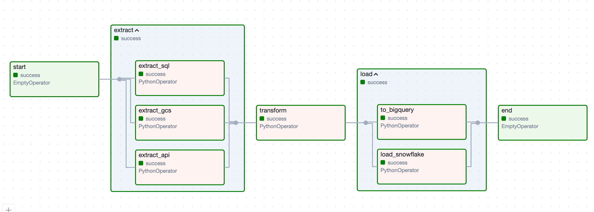

# Managing Complex Tasks with TaskGroup

## 1. TaskGroup

In Airflow, you can group tasks together using the `TaskGroup` class. This allows you to manage complex tasks more easily.

### Example

Extract **multiple data sources**, transform the data, and **load it into different destinations**.

Create a new DAG file `task_group.py`:

```python
from airflow import DAG
from airflow.operators.python_operator import PythonOperator
from airflow.operators.dummy_operator import DummyOperator

from airflow.utils.task_group import TaskGroup
from datetime import datetime

with DAG(
    dag_id='task_group',
    start_date=datetime(2024, 5, 10),
    schedule_interval="@daily",
    catchup=False
) as dag:

    def _task1():
        print('Hello, GCS')

    def _task2():
        print('Hello, API')

    def _task3():
        print('Hello, SQL')

    with TaskGroup(group_id='extract') as extract:
        task1 = PythonOperator(
            task_id='extract_gcs',
            python_callable=_task1
        )

        task2 = PythonOperator(
            task_id='extract_api',
            python_callable=_task2
        )

        task3 = PythonOperator(
            task_id='extract_sql',
            python_callable=_task3
        )

    transform = PythonOperator(
        task_id='transform',
        python_callable=lambda: print('Transforming data')
    )

    with TaskGroup(group_id='load') as load:
        task4 = PythonOperator(
            task_id='to_bigquery',
            python_callable=lambda: print('Loading data to BigQuery')
        )

        task5 = PythonOperator(
            task_id='load_snowflake',
            python_callable=lambda: print('Loading data to Snowflake')
        )

    start = DummyOperator(task_id='start')
    end = DummyOperator(task_id='end')

    start >> extract >> transform >> load >> end
```

**Result:**



[Back to Root](../../README.md)
[Go Next](../chapter-16/README.md)
