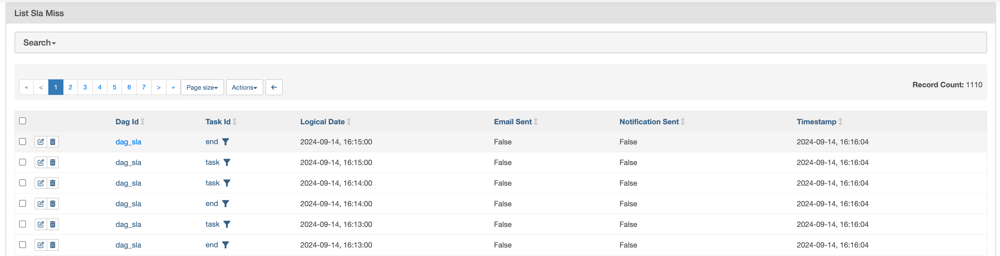

# SLA - Service Level Agreement

## What is SLA?

SLA stands for Service Level Agreement. It is a **contract between a service provider and a customer** that defines the **level of service** expected from the service provider.

## SLA in Apache Airflow

In the context of Apache Airflow, SLA is a way to define the **maximum time a task or a DAG should take to complete**. If the task or DAG takes more time than the defined SLA, it will be marked as failed.

You can view all the SLA misses in the `SLA Misses`: **Browse -> SLA Misses.**

## SLA in DAG

To define SLA for a DAG, you can use the `sla` parameter in the `default_args` dictionary. In this case, the SLA will be applied to all the tasks in the DAG.

Create an `dag_sla.py` file and add the following code:

```python
from airflow import DAG
from airflow.operators.dummy_operator import DummyOperator
from airflow.operators.python_operator import PythonOperator
from datetime import datetime
from datetime import timedelta
import time

default_args = {
    "sla": timedelta(minutes=1),
}

with DAG(
    dag_id="dag_sla",
    start_date=datetime(2022, 1, 1),
    schedule_interval="@daily",
    catchup=False,
    default_args=default_args,
) as dag:

    start = DummyOperator(task_id="start")

    def _task():
        print("Task is running")
        time.sleep(65)


    task = PythonOperator(
        task_id="task",
        python_callable=_task,
    )

    end = DummyOperator(task_id="end")

    start >> task >> end
```

Note: `time.sleep(65)` is used to simulate a task that takes more time than the defined SLA.

## SLA in Task

Create an `task_sla.py` file and add the following code:

```python
from airflow import DAG
from airflow.operators.dummy_operator import DummyOperator
from airflow.operators.python_operator import PythonOperator
from datetime import datetime
from datetime import timedelta
import time

with DAG(
    dag_id="task_sla",
    start_date=datetime(2022, 1, 1),
    schedule_interval="@daily",
    catchup=False,
) as dag:

    start = DummyOperator(task_id="start")

    def _task():
        print("Task is running")
        time.sleep(65)

    sla = timedelta(seconds=30)
    task = PythonOperator(
        task_id="task",
        python_callable=_task,
        sla=timedelta(minutes=1),
    )
    task.sla = sla

    end = DummyOperator(task_id="end")

    start >> task >> end
```

Note: `task.sla = sla` is used to define SLA for a specific task.

## SLA Callback

Modify `dag_sla.py` file, add `sla_callback` function, and pass it to the `sla_miss_callback` parameter in the DAG.

Reference: [Apache Airflow Documentation](https://airflow.apache.org/docs/apache-airflow/stable/core-concepts/tasks.html#slas)

```python
from airflow import DAG
from airflow.operators.dummy_operator import DummyOperator
from datetime import datetime
from datetime import timedelta

def sla_callback(dag, task_list, blocking_task_list, slas, blocking_tis):
    print(
        "SLA missed with informations: ",
        {
            "dag": dag,
            "task_list": task_list,
            "blocking_task_list": blocking_task_list,
            "slas": slas,
            "blocking_tis": blocking_tis,
        },
    )

with DAG(
    ...,
    sla_miss_callback=sla_callback,
) as dag:
    ...
```

### Checkpoint



[Back to Root](../../README.md)
